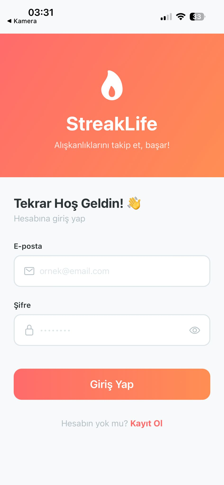
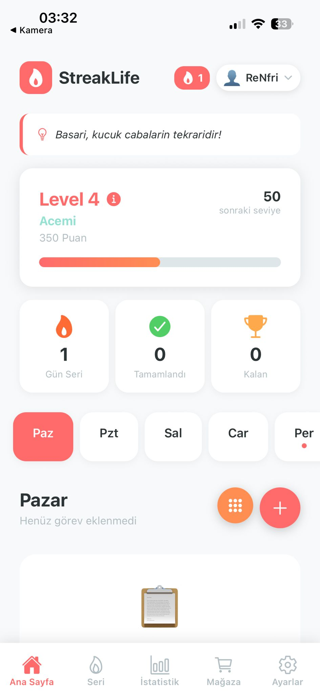

# 🎯 StreakLife - Gamified Daily Habit & Task Tracker

A modern, gamification-based daily habit building and task tracking mobile application built with **React Native** and **Expo**.

**StreakLife** is designed to help users build and maintain discipline through a rewarding system. By completing tasks, users earn points, level up, and maintain daily "streaks" to keep their motivation alive.

---

## 📸 App Preview

| Login Screen | Main Dashboard |
| --- | --- |
|  |  |

> 💡 **Tip for GitHub:** To display your screenshots like above, create a folder named `assets/screenshots/` in your project directory. Save your images there as `login.jpeg` and `dashboard.jpeg`, then push them to GitHub.

---

## ✨ Features

* **🔐 Modern Authentication:** Clean and secure login interface with user session management.
* **📊 Gamified Level System:** Earn XP/Points (e.g., 350 Puan) by completing daily tasks and level up from "Acemi" to advanced tiers.
* **🔥 Dynamic Streak Tracking:** Visually displays your consecutive successful days (Gün Seri) to reinforce consistency.
* **📅 Weekly Planner Layout:** Fast navigation between days (Paz, Pzt, Sal...) to manage past and upcoming goals.
* **💡 Daily Motivational Quotes:** Dynamic header cards that display inspiring quotes like *"Başarı, küçük çabaların tekrarıdır!"* to boost user retention.
* **🛒 Built-In Features (Expansion Ready):** Equipped with dedicated bottom tab navigators for a **Mağaza (Store)** and **Ayarlar (Settings)** page, opening paths for future point redemption systems.

---

## 🛠️ Tech Stack & Architecture

* **Framework:** [React Native](https://reactnative.dev/) (Component-based UI architecture)
* **Tooling & Runtime:** [Expo](https://expo.dev/) (Managed workflow for seamless cross-platform delivery)
* **Language:** JavaScript / JSX
* **Navigation:** React Navigation (Bottom Tabs & Native Stack)
* **State Management:** Local Persistence (`AsyncStorage`) to maintain user levels, login tokens, and streaks offline.

---

## 🚀 How to Run the Project (Installation & Local Development)

Follow these steps to set up and run the project locally on your machine:

### 1. Prerequisites
Make sure you have the following installed on your computer:
* [Node.js](https://nodejs.org/) (LTS Version recommended)
* Git

### 2. Clone the Repository
Open your terminal or command prompt and run the following commands to clone the repository and navigate into the project folder:
```bash
git clone [https://github.com/YOUR_GITHUB_USERNAME/streak-app.git](https://github.com/YOUR_GITHUB_USERNAME/streak-app.git)
cd streak-app
```
### 3. Install Dependencies
Install all the required packages specified in the package.json file:

```Bash
npm install
# or if you use yarn:
yarn install
```
### 4. Start the Expo Development Server
Launch the local development server using Expo:

```Bash
npx expo start
```
### 5. Run on Your Mobile Device (iOS / Android)
Download the Expo Go application from the App Store (iOS) or Google Play Store (Android) onto your phone.

Ensure your computer and your phone are connected to the same Wi-Fi network.

Scan the QR Code displayed in your terminal (or on the Expo developer webpage) using your phone's camera (iOS) or the Expo Go app (Android).
